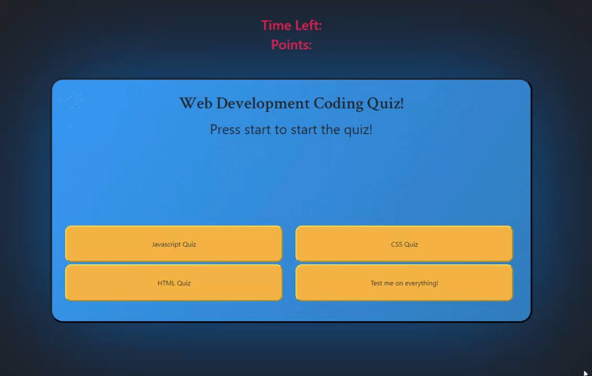

---

# Web Developer Coding Quiz

### [Click Here To Play](link)

#### **8/13/2020** 

## Description:
Quiz your web development knowledge. You can choose to study Javascript, HTML, CSS, or if you're feeling confident you can try your hand at all of the questions. You have 90 seconds to finish the quiz, good luck!

## Features
- Multiple categories of questions (choose all of them to score even more points!)
- Locally stored leaderboard
- Randomized answer positions (no cheating by memorizing positions)
- Modular questions and leaderboard so they can be easily modified
- Debug Mode for designers (type `debugMode = true` in console)

##### Noteworthy:
- A difficult part of this project was actually coming up with good, fair questions and answers to populate the quiz.

## Execution:
1. Created HTML / CSS Layout
2. Added script solely to hold the questions in an object array
3. Made questions appear randomly with answers in random positions
4. Added Game Over Screen
- When the answer buttons are created, an onclick attribute with either the respective "correctAnswer" or "wrongAnswer" function attached to them
- The Questions are drawn from a questions.js file where they are stored in an object array
- The Leaderboard is also an object array, and I remade it to be modular so that it can hold any number of entries and iterate through them (for example, it would be easier to create a multiple page leaderboard with this)

### Things I learned
- How to use Psuedoelements! They are awesome!!! I used them to create the main #quiz-area
- Learned more about objects and how they interact with arrays and localstorage
- How to manipulate buttons and change them at real-time so depending on the content they do different things